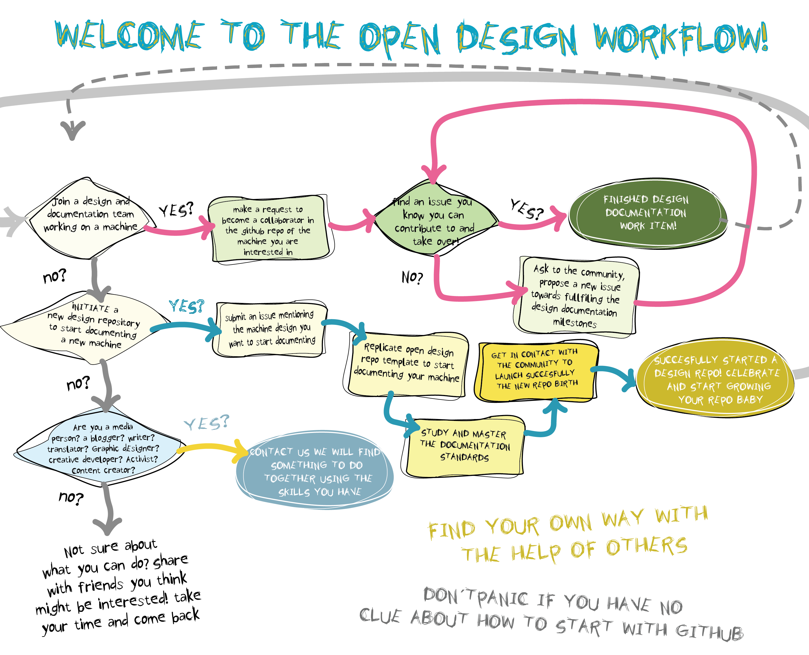

# General guidelines:
A key success factor for this initiative is the continuous and concurrent production of design documentation repositories for different machines (dishwashers, washing machines, the machine you wish to design-document). A baby repo of a machine, should grow from non tested and verified documentation, to partial verification of modules and subassemblies, heading towards  its mature age with a fully documented machine, tested, peer reviewed and ready for replication.

The path to repo maturity also goes from understanding and learning from existing models of machines towards curated and selected solutions that represent the champion version of the machine for a specific usage scenario.

## Who can contribute?
There is plenty of room for anyone to jump in and make this happen. From apprentices to experts, from students to teachers, from kids to grandpas. We are still figuring out how to make it from ants to elepahnts, but we are getting there.

## Why to contribute?
Become an open sorcerer and cultivate this craft. Learn it, practice it, teach it, improve it. It is a path towards fun, challenge, mistery, self discipline, growth, excellence , leadership, the common good and the planet! Its an infinite win-win-win chain!  

## How to contibute?
There are several ways in which you can participate. Read carefully the infographic and then the detailed explanations below.

## 1. Join a design and documentation team working on a machine.

If you want to learn open design this is the best place to start. If you want to learn or get skilled in a particular area like CAD modeling, CAD Analysis, Hardware Electronics Design, among many others, this is also the right place to start. We have work items, with different levels of complexity.

#### 1.1. Make a request to become a collaborator in the github repo of the machine you are interested in.
Make the request at the specific machine repository.[Find the list of repositories here](https://github.com/goscommons).

#### 1.2 . Find an issue you know you can contribute to and take over!
Go to the project repository, to the issues section, and see what has been posted.

#### 1.3. You have finished your design documentation piece of work. Make a pull request and get feedback from your peers. This is the last step to finally get your work published, ready to be used and improved by others.

Celebrate and get inspired! Go back to step 1.2 and find a new exciting issue to solve.**

What can you do if you don't find an issue Ask to the community, propose a new issue towards fulfilling the design documentation  milestones.

### 2. Initiate a new design repository to start documenting a new machine.

.  If you are comfortable and feel you have what it takes to take over the design documentation of a particular machine, this is for you.

. If you feel you need to learn a lot but still you are committed to push forward the documentation of a machine, we will help you to get started. You could also get experience by working with a team, already lifting the champion flag to start a new repo.

. If you are a technically skilled person and want to go to a next level of community and project management, using lean and scrum, this is a good start.

. If you are a good manager, and have experience with open workflows, and community management, and this is how you can better contribute this is also for you.

#### 2.1. Submit an issue mentioning the machine design you want to start documenting.

#### 2.2. Replicate open design repo template to start documenting your machine.**
Take a look at the [Open-Design-Template repository](https://github.com/goscommons/Open-Design-Template/wiki) we have to make things easier for you. The template we are providing you with is inspired by the *Project Structure Guidelines* proposed by the [Open Hardware Repository](https://www.ohwr.org/projects/ohr-support/wiki/project-structure-guidelines).

#### 2.3. Study and master the open design documentation standards.**
The template

Assessing the maturity of a repository, and level of readiness for replication.

## 3.Are you a media person? a blogger? writer? translator? graphic designer? creative developer? Activist? content creator?

CONTACT US WE WILL FIND SOMETHING TO DO TOGETHER USING THE SKILLS YOU HAVE via goscommons@gmail.com
