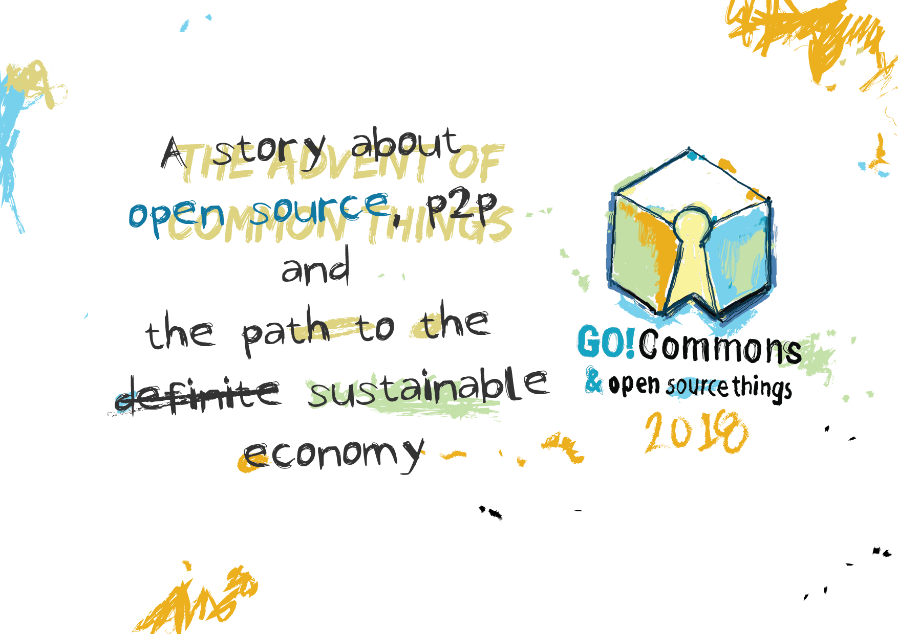

# Hi! We warmly welcome you to the main repository of the Open Source Appliances initiative
## This is an open hardware project focused on the design and development of open hardware appliances.
Currently it is a research and development project, that aims to share and publish source code, hardware electronics, CAD models and materials to manufacture, but also improve open designs for commercial products from consumer electronics to industrial machines.
### Why open hardware appliances and industrial machines
* Open access to the knowledge and DNA of goods, services and products, allow us to enjoy social wealth and share responsibility.
* Having a commons oriented economy where the knowhow is shared as a fundamental right to act for the common good, prosperity and development is a key element in sustainable development. Open hardware empowers consumers, and producers, but also impact makers, local economies and communities.
* Moreover the free access to the design of things, facilitates their repair, as well as the systematic, organized and collaborative improvement of such design coming from users all over the world.
* Free/libre software and open source practices has empowered tremendously many people, the same can happen with hardware. It is happening more and more.
### Get involved
###[Read the contributing guidelines](https://github.com/goscommons/goscommons.github.io/blob/master/CONTRIBUTING.md)
Become a contributor and find a role that matches your capabilities.

### Want to know more about the project and where we are?
#### Visit [our website](https://goscommons.github.io)and our  [roadmap](https://github.com/goscommons/goscommons.github.io/projects/1).

##Donate to [our campaign](https://www.youcaring.com/gocommons-1085010) and get our illustrated book about open source and p2p as a thank for being part of our community.

